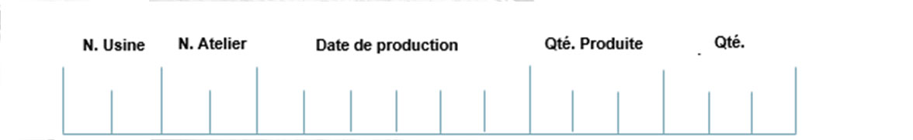
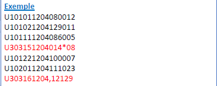
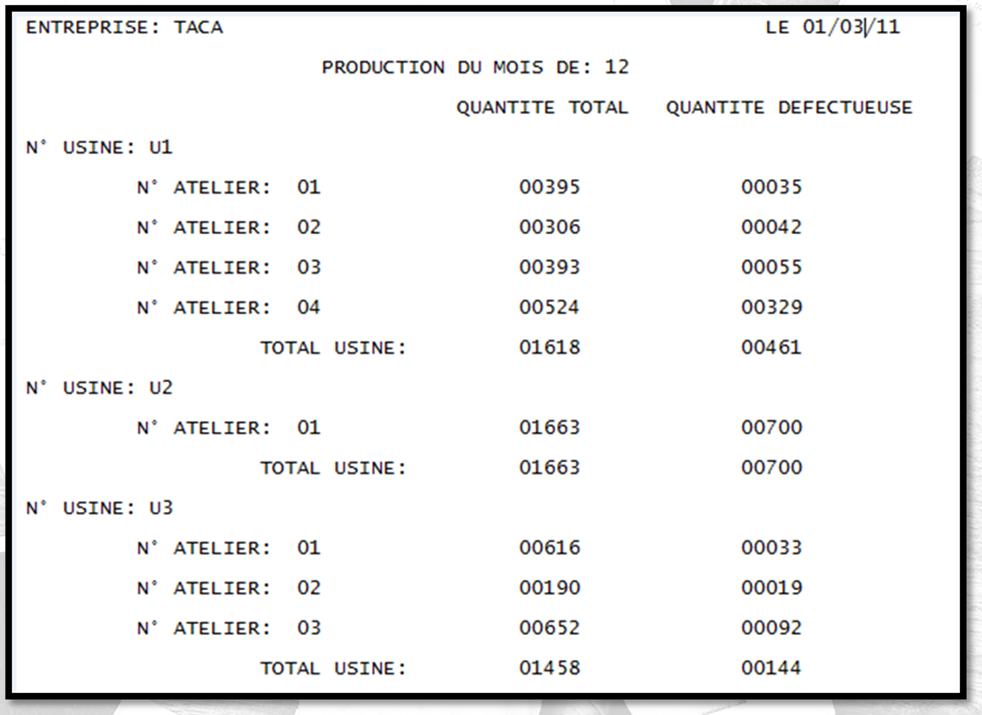
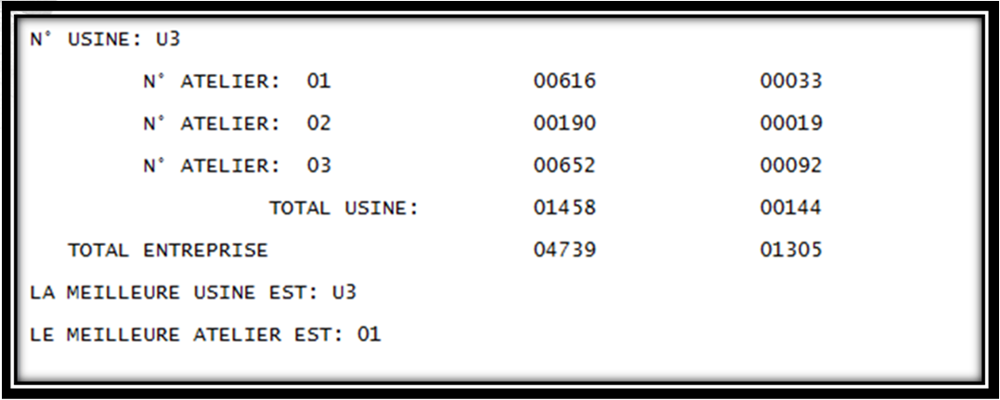
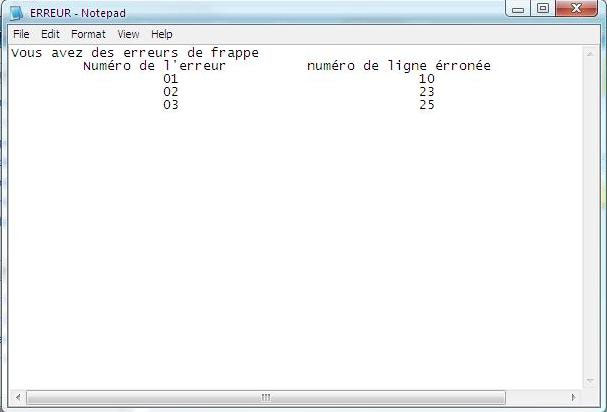

  

<h3 align="center">COBOL POE - Part 2</h3>

---

# Notes:

``PGM015.cbl`` is the COBOL program.  
``PGM015FC.cpy`` & ``PGM015FS.cpy`` are copybooks.  
``FILE015`` is input file. (*just example*)  
``compilation`.jcl`` & ``execution`.jcl`` are JCL code.   
Be sure to verify the **JCL** to make sure that it works on your zOS.  
I explain my setup here : [settings](../README.md/#settings)

# Formation COBOL -  Appareillage de fichiers

## 1.	Objectif de la fiche :  

- Le but de ce programme est de lire les données sur les produits d’une
société qui sont stockés dans un fichier <Produit>.
- L’entreprise COBOLISTE nous a demandé d’éditer un programme cobol pour
afficher un état récapitulatif des statistiques mensuel donnant la quantité
totale produite par atelier par usine et pour toute l’entreprise ainsi que les
quantités défectueuses au cours d’une période déterminée

### Structure de données

- Nous avons comme données en entrée le fichier dont la description d’un
enregistrement est la suivante :

  

- En ce qui concerne les résultats, nous avons créé deux fichiers :
« Résultats » et « Erreurs» qui contiennent respectivement les résultats
et les erreurs obtenues lors de l’exécution du programme.

### Contraintes

- Il est à préciser que l’entreprise est constituée de trois usines et chaque
usine est composée d’un certain nombre d’ateliers (maximum cinq par
usine) et qu’il faut afficher à la fin du rapport la meilleure usine et le
meilleur atelier. Il reste à noter que le fichier utilisé peut contenir des erreurs
de saisie.

- Pour tester notre programme nous avons adapté le fichier « PRODUIT »
dont les enregistrements erronés sont en rouge :

  

### Etat de Sortie

  

  

### Affichage des erreurs

  

